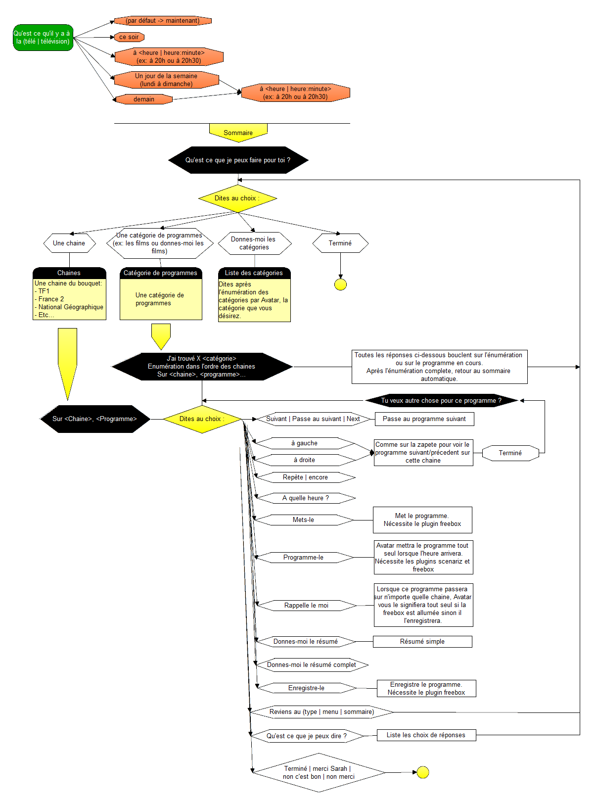

# freeboxTV

Ce plugin est un add-on pour le framework [Avatar](https://github.com/Spikharpax/Avatar-Serveur) ou [Avatar 3.0](https://github.com/Spikharpax/Avatar-Serveur-3.0)

Récupère les programmes TV par l'EPG (Electronic Program Guide) de la freebox Player.

Il permet de demander à Avatar le programme tv:
- Du moment
- Du soir
- Du lendemain
- A une heure donnée
- Pour un jour de la semaine à une heure donnée
- Demandez le programme sur la chaine de votre choix
- Mais aussi la possibilité par catégorie de programmes:
	- Avatar vous énumère les programmes trouvés par la catégorie que vous voulez
- Demandez à Avatar de mettre le programme lorsqu'il passera et il changera de chaine automatiquement lorsque le moment sera venu
- Fonction rappel de programme:
	- Si un programme favori passe, à n'importe quelle heure et sur n'importe quelle chaine:
		- Si la freebox est éteinte, Avatar l'enregistrera automatiquement
		- Si la freebox est allumée, Avatar vous le proposera
	- Vous pouvez aussi l'enregistrer
- Sélection et filtrage des chaines que vous voulez par le bouquet que vous voulez.

## Plugins nécessaires
- Plugin 'scenariz'
	- Pour le rappel des programmes favoris.
- Plugin 'freebox'
	- Pour permettre de changer de chaine si un programme favori passe ou pour l'enregistrer.
	
	
## Installation
- Dézippez le fichier `Avatar-Plugin-freeboxTV-Master.zip` dans un répertoire temporaire
- Copiez le répertoire `freeboxTV` dans le répertoire `Avatar-Serveur/plugins`

## Configuration

### Bouquet

Ajoutez dans la propriéte "bouquets" le bouquet qui est à utiliser pour énumérer les programmes TV.
Pour toutes les chaines, vou pouvez mettre "Freebox TV"

Par défaut, à l'installation, le bouquet utilisé est "favori"

### Lexic

Certains noms de chaines sont mal reconnus par la reconnaissance vocale, vous pouvez alors ajouter dans le lexic des termes qui seront mieux reconnus par Avatar pour chaque chaine.
A gauche, le véritable noms de la chaine, à droite, un tableau de lexic.

## Utilisation

Ci-dessous le diagramme d'utilisation du plugin.

 

### Connaitre les programmes qui ont été enregistrés
**Note**:
- Cette commande nécessite le plugin Freebox.
- Nécessite d'avoir utilisé la commande "rappelle-le moi" pour ajouter le programme à vos rappels de programmes.

Elle vous permet de savoir quels sont les programmes qui ont été enregistrés en votre absence.

Syntaxe:
- **record** ... **programs|program**

Exemple:
- Tu as enregistré des programmes ?
- Dis-moi si tu as enregistré des programmes
- Donne-moi les programmes enregistrés

Le plugin vous énumère dans l'ordre des jours d'enregistrement ce qu'il a enregistré.

  
 

## Versions
Version 1.1
- - Ajout d'un répertoire assets pour une description et une image (Avatar 3.0)

Version 1.0 
- Version Released

